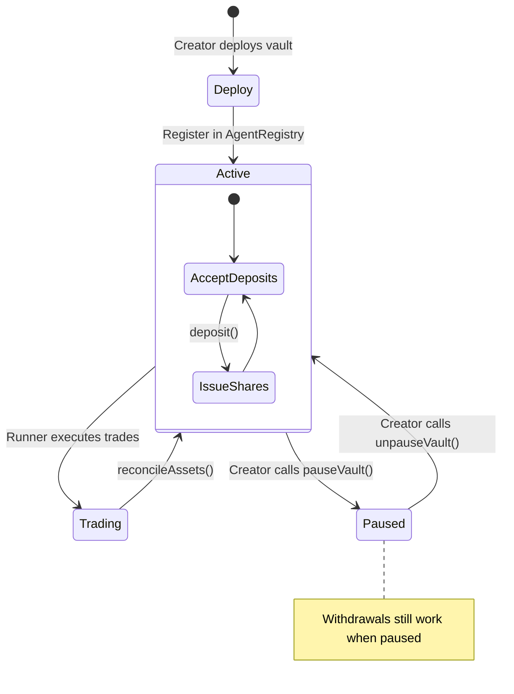
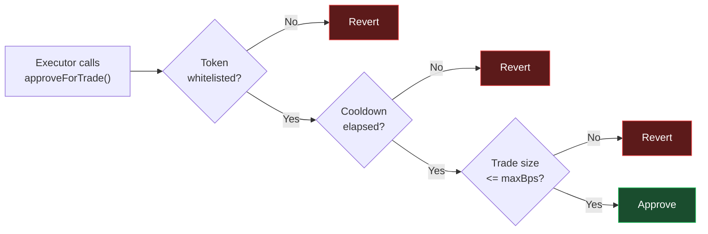

# Agent Vault

The Agent Vault is the core financial primitive of InitiaAgent. It holds subscriber funds, issues proportional shares, and gates all trade execution through strict validation.

## Vault Lifecycle



## Share-Based Accounting

The vault uses an **ERC-4626-style** share mechanism:

- On **first deposit**, shares are minted 1:1 with the deposited amount
- On **subsequent deposits**, shares are minted proportionally: `shares = amount * totalShares / totalAssets`
- On **withdrawal**, assets are returned proportionally: `assets = shares * totalAssets / totalShares`

As the vault generates profit through trading, `totalAssets` increases while `totalShares` stays constant — making each share worth more over time.

## Deposit

```
subscriber.approve(vault, amount)
vault.deposit(amount)
```

- Subscriber receives proportional shares
- Subscriber count in the registry increments automatically
- Subject to `depositCap` — reverts with `DepositCapExceeded` if cap is reached
- Blocked when vault is paused (reverts with `VaultPaused`)

## Withdrawal

```
vault.withdraw(sharesToRedeem)
```

- Returns assets proportional to shares held
- **Always available** — no `whenNotPaused` guard
- Subscribers can exit even if the vault is paused by the creator
- Reverts with `InsufficientShares` if subscriber doesn't hold enough

## Trade Approval

The vault does not execute trades directly. Instead, it **approves** the `AgentExecutor` to pull tokens:

```
vault.approveForTrade(token, amount)  // only callable by executor
```

Before approving, the vault checks:

| Check | Parameter | Default | Hard Limit |
|---|---|---|---|
| Trade size | `maxTradeBps` | 10% of total assets | 30% max |
| Cooldown | `intervalSeconds` | 15 minutes | 60 seconds min |
| Token whitelist | `allowedTokens` | Set at deployment | — |

If any check fails, the approval reverts and no trade occurs.



## Reconciliation

After each trade, the vault's `totalAssets` is synced with its actual token balance:

```
vault.reconcileAssets()
```

This is called automatically by the executor after each swap completes.

## Creator Controls

The vault creator can:

| Action | Function |
|---|---|
| Pause new deposits | `pauseVault()` |
| Resume deposits | `unpauseVault()` |
| Update deposit cap | `updateDepositCap(newCap)` |
| Update executor | `updateExecutor()` |

The creator **cannot**:
- Withdraw subscriber funds
- Change the splitter after it's set
- Override the cooldown or trade size hard limits

## Splitter Lock

The splitter address is set once via `setSplitter()`. Any subsequent call reverts with `SplitterAlreadySet`. This prevents the creator from replacing the profit distribution contract after deployment.
