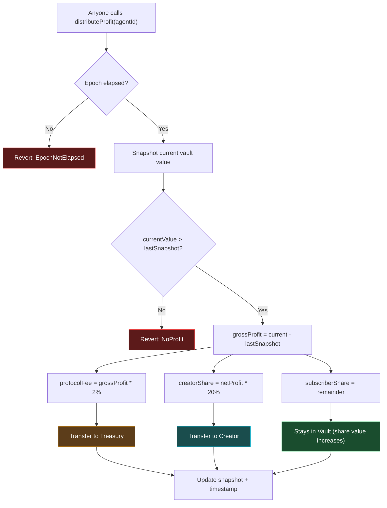
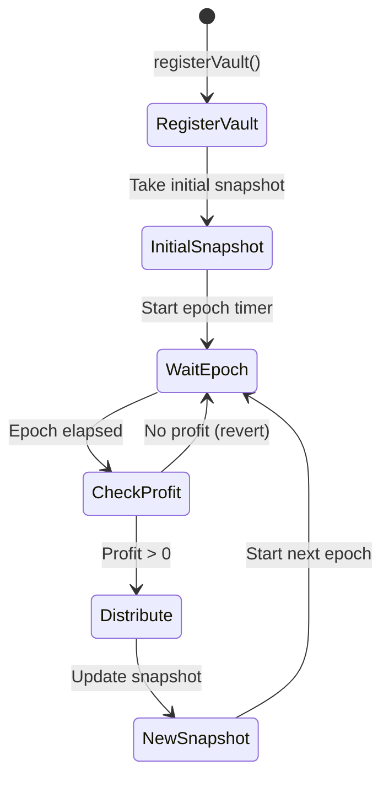

# Profit Sharing

Profit distribution in InitiaAgent is automated, permissionless, and epoch-based.

## How It Works

At the end of each epoch, anyone can trigger profit distribution by calling `ProfitSplitter.distributeProfit(agentId)`. There is no privileged caller — this is a fully permissionless operation.

### Distribution Flow



### Distribution Formula

```
grossProfit = currentVaultValue - lastSnapshotValue

protocolFee    = grossProfit * 2%      → Protocol Treasury
creatorShare   = (grossProfit - protocolFee) * 20%  → Creator Wallet
subscriberShare = remainder            → Stays in Vault
```

### Effective Split

| Recipient | Share of Gross Profit | How They Receive It |
|---|---|---|
| **Protocol** | 2% | Transferred to treasury address |
| **Creator** | ~19.6% | Transferred to creator wallet |
| **Subscribers** | ~78.4% | Remains in vault, increases share value |

Subscribers don't need to claim their share — it automatically increases the value of their vault shares.

## Epoch Timing

| Parameter | Default | Range |
|---|---|---|
| `epochDuration` | 7 days (604,800 seconds) | Configurable by protocol owner |

Distribution can only be triggered after the epoch duration has elapsed since the last distribution. The `canDistribute(agentId)` view function returns whether distribution is available and how many seconds remain.

## Fee Caps

Both the protocol fee and creator share have hard caps enforced at the contract level:

| Parameter | Hard Cap |
|---|---|
| `protocolFeeBps` | 10% (1,000 bps) |
| `creatorShareBps` | 50% (5,000 bps) |

These caps cannot be exceeded, even by the contract owner.

## No-Profit Epochs

If the vault value has not increased since the last snapshot (no profit was generated), `distributeProfit` reverts with `NoProfit`. No fees are extracted during flat or negative periods.

## Snapshot Mechanism



1. On vault registration, `ProfitSplitter.registerVault()` takes an initial snapshot of the vault's `totalAssets`
2. After each successful distribution, a new snapshot is taken
3. The snapshot is the baseline for computing profit in the next epoch

This ensures that profit is only calculated on **new gains** since the last distribution.
