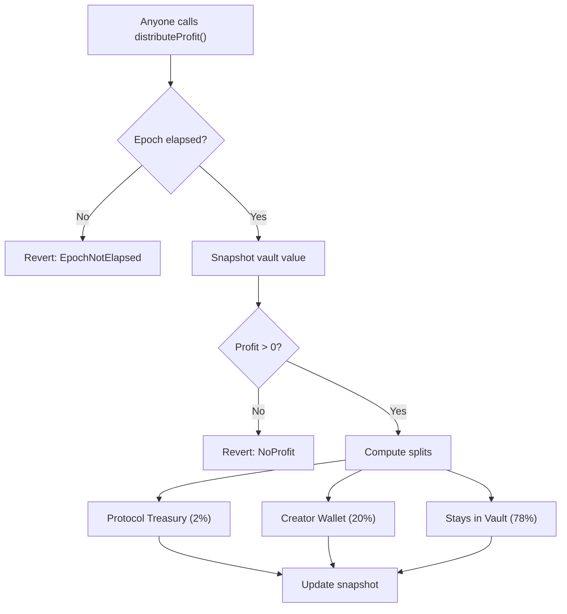

# How It Works

## Overview

InitiaAgent connects three participants — **subscribers**, **creators**, and **runners** — through a set of smart contracts that enforce non-custodial fund management.

```mermaid
sequenceDiagram
    participant S as Subscriber
    participant V as AgentVault
    participant E as AgentExecutor
    participant D as InitiaDEX (Cosmos)

    S->>V: deposit()
    Note over V: Issues Shares

    rect rgb(40, 40, 60)
    Note over V,D: Trading Session (loop)
    E->>V: approveForTrade()
    Note over V: Check Cooldown/Cap
    E->>D: executeSwap() via Precompile
    D-->>V: Returns Assets
    E->>V: reconcileAssets()
    end

    S->>V: withdraw()
    Note over V: Redeems Shares
    V-->>S: Returns Assets
```

## Step-by-Step Flow

### 1. Creator Sets Up an Agent

1. Deploy an `AgentVault` with strategy parameters (trade size, cooldown, allowed tokens, deposit cap)
2. Register the agent in `AgentRegistry` — receives an `agentId`
3. Register the vault in `ProfitSplitter` — takes an initial value snapshot
4. Authorize one or more runners in `AgentExecutor`

### 2. Subscriber Deposits

1. Approve the vault to spend their tokens (`token.approve`)
2. Call `vault.deposit(amount)` — receives proportional shares
3. Subscriber count increments automatically in the registry

Shares represent a proportional claim on the vault's total assets. As profits accumulate, each share becomes worth more.

### 3. Runner Executes Trades

1. Runner calls `executor.executeSwap(agentId, tokenIn, tokenOut, amountIn, minAmountOut, deadline)`
2. The executor validates:
   - Runner is authorized for this agent
   - Agent is active
   - Deadline has not passed
   - Tokens are different
   - Minimum output is specified
3. The vault approves the trade after checking:
   - Cooldown has elapsed since last trade
   - Trade size is within `maxTradeBps` of total assets
   - Token is whitelisted
4. Executor pulls `tokenIn` from vault, swaps via DEX, output returns to vault
5. Vault reconciles its asset balance
6. Registry updates volume traded

### 4. Profit Distribution

1. Anyone calls `splitter.distributeProfit(agentId)` after the epoch duration has elapsed
2. Splitter snapshots the vault's current value
3. If value increased since last snapshot:
   - **2%** of profit goes to protocol treasury
   - **20%** of net profit goes to the creator
   - **78%** remains in the vault (increases share value for subscribers)
4. Snapshot and timestamp are updated

### 5. Subscriber Withdraws

1. Call `vault.withdraw(shares)` at any time — no lock-up period
2. Receive assets proportional to shares held
3. This works even if the vault is paused by the creator

## Profit Distribution Flow

## Security Guarantees

| Guarantee | How It's Enforced |
|---|---|
| Creator cannot steal funds | No `withdraw` path for creator; `withdrawForSplitter` is locked to splitter address |
| Splitter cannot be replaced | `setSplitter` reverts with `SplitterAlreadySet` on second call |
| Trades are bounded | `maxTradeBps` (hard cap 30%) and `intervalSeconds` (min 60s) |
| Withdrawal always works | `withdraw` has no `whenNotPaused` modifier |
| Profit distribution is permissionless | `distributeProfit` is callable by any address |
