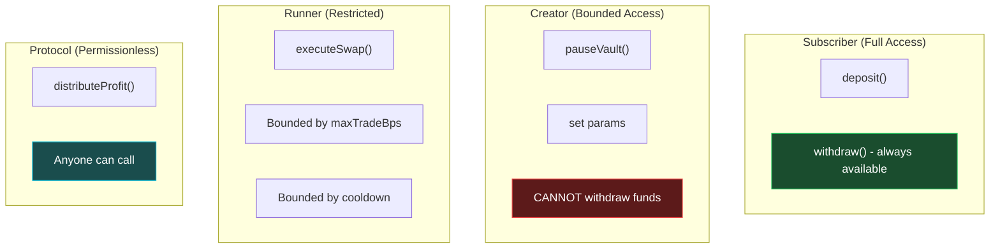

# Solution

## InitiaAgent: Non-Custodial Agent Marketplace

InitiaAgent is a four-contract system that separates concerns cleanly across distinct roles:

### Roles

| Role | Capabilities | Restrictions |
|---|---|---|
| **Subscriber** | Deposit tokens, receive shares, withdraw at any time (even when paused) | — |
| **Creator** | Define strategy parameters (trade size limit, cooldown, allowed tokens) | Cannot withdraw subscriber funds |
| **Runner** | Submit signed swap commands for execution | Each command is validated before any fund movement |
| **Protocol** | Collects a fixed basis-point fee per epoch | Fee distributed automatically, no privileged call needed |

### Security Model

### Key Design Principles

**Non-Custodial by Design**
The creator sets parameters but is structurally blocked from accessing subscriber funds. There is no admin key, no upgrade path, and no backdoor. The only way funds leave the vault is through subscriber withdrawal or protocol-level profit distribution.

**Permissionless Profit Distribution**
Anyone can call `distributeProfit` once an epoch has elapsed. No single party controls when or whether profits are distributed.

**Instant Exit**
Subscribers can call `withdraw` at any time. The function has no `whenNotPaused` guard — even if the creator pauses the vault, subscribers can still exit with their assets.

**Bounded Autonomy**
Runners cannot execute arbitrarily large trades. Every trade is validated against:
- Maximum trade size (`maxTradeBps`, hard-capped at 30%)
- Cooldown interval (`intervalSeconds`, minimum 60 seconds)
- Token whitelist (only pre-approved tokens)
- Slippage guard (`minAmountOut`)

### How It Differs from Existing Solutions

| Approach | Custody | Marketplace | Profit Sharing |
|---|---|---|---|
| Copy-trading platforms | Custodial | Yes | Manual |
| Yield aggregators | Semi-custodial | No | Automatic |
| Single-owner vaults | Non-custodial | No | None |
| **InitiaAgent** | **Non-custodial** | **Yes** | **Automatic** |
