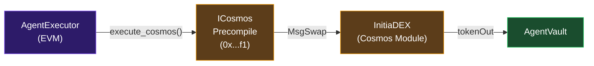

# Why Initia?

InitiaAgent is built specifically for the Initia ecosystem, leveraging features that are unique to the Initia L2 rollup architecture.

## ICosmos Precompile: Atomic Cross-Layer Swaps

The Initia `evm-1` rollup exposes the **ICosmos precompile** at address `0x00000000000000000000000000000000000000f1`. This precompile allows Solidity contracts to execute Cosmos SDK messages directly within an EVM transaction.

For InitiaAgent, this means:

- **No wrapped DEX contract needed** — swaps route directly to the Initia DEX module
- **Atomic execution** — the swap either completes fully or reverts, no partial fills
- **Native liquidity access** — trades execute against Initia's native liquidity pools, not a separate EVM-only DEX

This happens in a single transaction with no bridging delay.

## Session UX (Auto-Signing)

Initia's **InterwovenKit** provides a Session UX feature (also called Ghost Wallet) that enables:

- **Auto-signing** for approved message types (`/minievm.evm.v1.MsgCall`, `/cosmos.bank.v1beta1.MsgSend`)
- **Sub-second latency** (~0.01s) for trade execution
- **No popup fatigue** — once a session is enabled, transactions execute seamlessly

This is critical for a trading platform where:
- AI runners need to execute trades rapidly
- Subscribers interact with multiple contracts (approve, deposit, withdraw)
- Manual confirmation per transaction would break the UX

## Interwoven Rollup Architecture

Initia's rollup model provides:

| Feature | Benefit for InitiaAgent |
|---|---|
| EVM compatibility | Standard Solidity tooling (Foundry, Wagmi, Viem) |
| Cosmos interop | Access to Initia DEX liquidity via precompile |
| L2 throughput | Fast block times for responsive trading |
| Shared security | Secured by Initia L1 validators |

## Hackathon Alignment

| Requirement | Implementation |
|---|---|
| Appchain / Rollup | Deployed on `evm-1` (Chain ID: `2124225178762456`) |
| InterwovenKit | Integrated via `@initia/interwovenkit-react` |
| Native Feature | Session UX / Auto-signing for seamless trade execution |
