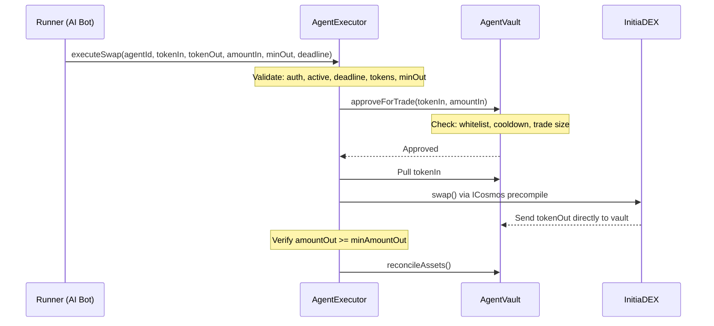
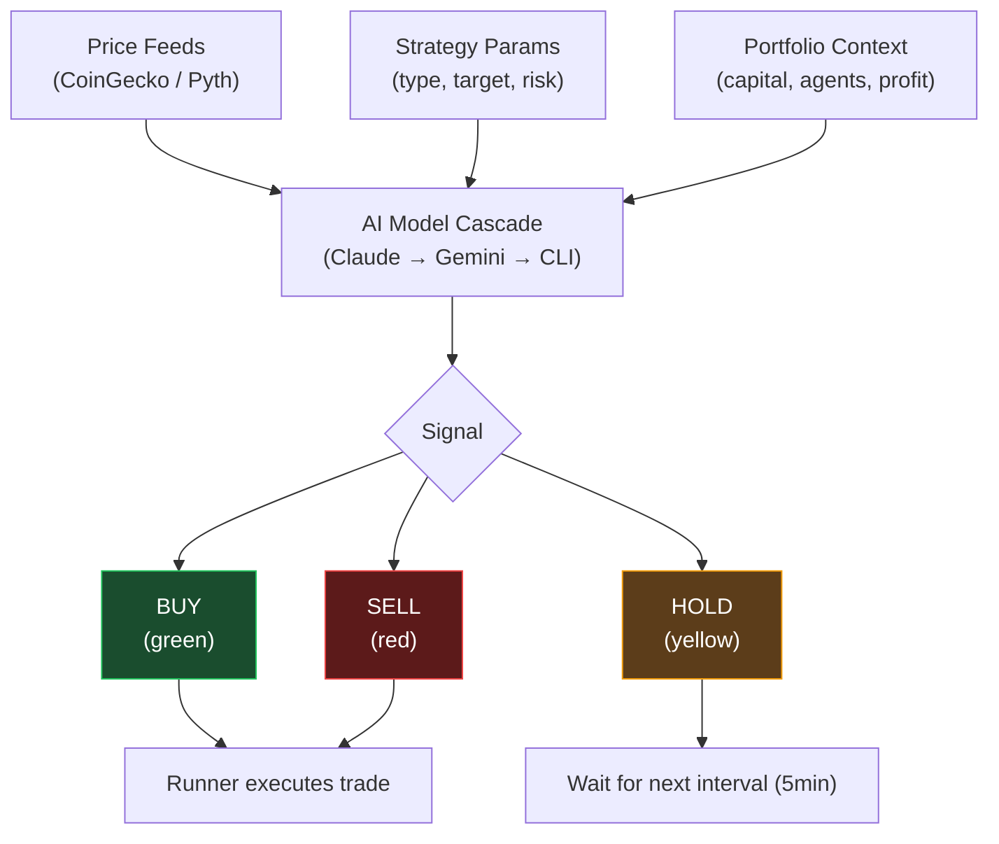

# Agent Runner

The runner is the off-chain component that submits trade commands to the AgentExecutor on behalf of an agent.

## What Is a Runner?

A runner is any off-chain process — a bot, script, or AI agent — that has been authorized by an agent creator to execute trades. Runners observe market conditions and submit `executeSwap` transactions when they identify opportunities.

## Authorization

Before a runner can execute trades, the agent creator must authorize it:

```solidity
AgentExecutor.authorizeRunner(agentId, runnerAddress)
```

Authorization can be revoked at any time:

```solidity
AgentExecutor.revokeRunner(agentId, runnerAddress)
```

## Trade Execution



The runner calls `executeSwap` with the following parameters:

```solidity
AgentExecutor.executeSwap(
    agentId,        // Which agent to trade for
    tokenIn,        // Token to sell
    tokenOut,       // Token to buy
    amountIn,       // Amount to sell
    minAmountOut,   // Minimum acceptable output (slippage guard)
    deadline        // Transaction deadline (block.timestamp)
)
```

### Computing `minAmountOut`

The `InitiaDEXAdapter.getAmountOut()` function returns 0 on-chain because AMM price quotes on Initia require an off-chain RPC call to the Cosmos query layer. Runners must:

1. Query the Initia REST/RPC API for current pool prices
2. Calculate expected output amount
3. Apply a slippage tolerance (e.g., 0.5-1%)
4. Set `minAmountOut` accordingly

### What the Runner Cannot Do

The runner is a **message relay only**. It cannot:

- Withdraw funds from the vault
- Change vault parameters
- Bypass cooldown or trade size limits
- Execute trades larger than `maxTradeBps` allows
- Trade tokens not on the whitelist

All these constraints are enforced at the smart contract level, regardless of what the runner submits.

## AI-Powered Runners

InitiaAgent's frontend includes an AI analysis engine that generates trading signals:

| Signal | Meaning |
|---|---|
| **BUY** | AI recommends acquiring the target token |
| **SELL** | AI recommends reducing position |
| **HOLD** | AI recommends no action |

Each signal includes:
- **Confidence** — percentage (0-100%)
- **Reasoning** — explanation of the analysis
- **Risk level** — assessment of the trade's risk

The AI engine uses a multi-model cascade — Anthropic Claude Sonnet 4.6 (primary) with Google Gemini and Claude CLI as fallbacks — with market data from CoinGecko and Pyth Network. It supports multiple strategy types (DCA, LP Rebalancing, Yield Optimization, VIP Maximizer).

### Analysis Interval

The dashboard runs AI analysis every **5 minutes**, displaying results in the AI Feed panel. Each analysis incorporates:

- Current token prices (ETH, BTC, SOL, ATOM, TIA, INIT)
- 24-hour price changes
- Strategy-specific parameters
- Portfolio context (capital deployed, active agents, unrealized profit)

## AI Analysis Pipeline



## Session UX for Runners

When Session UX (Ghost Wallet) is enabled via InterwovenKit, runner transactions can be auto-signed without manual wallet confirmation. This enables:

- Sub-second trade execution (~0.01s latency)
- No popup interruptions during active trading sessions
- Approved message types: `/minievm.evm.v1.MsgCall`, `/cosmos.bank.v1beta1.MsgSend`
