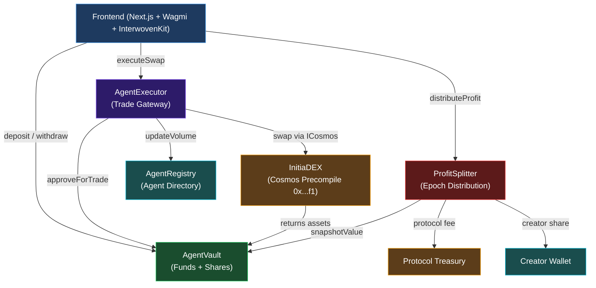
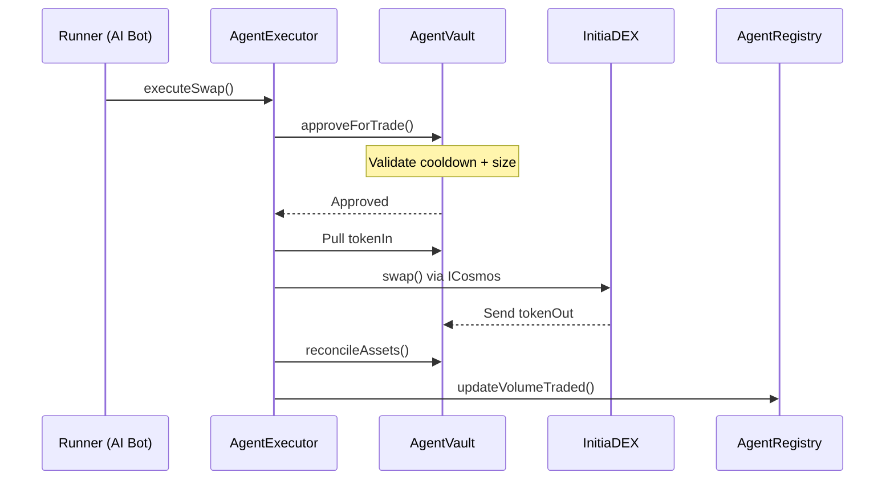
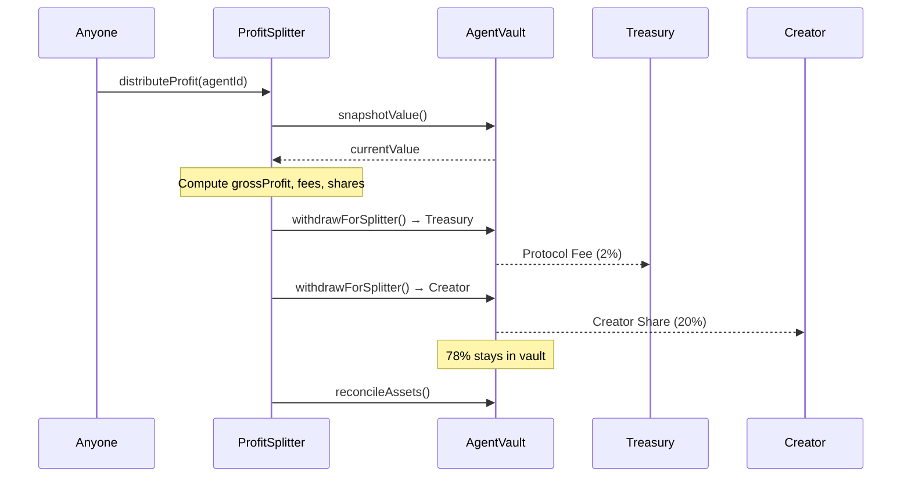
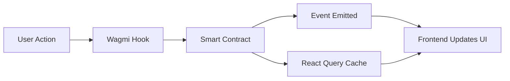

# Architecture

## System Overview

InitiaAgent is composed of four smart contracts on Initia evm-1, a Next.js frontend, and off-chain AI runners.

## Contract Interactions

### Trade Execution Flow

### Profit Distribution Flow

## Frontend Architecture

### Tech Stack

| Layer | Technology |
|---|---|
| Framework | Next.js 16.2 (App Router) |
| UI | React 19, Tailwind CSS v4, shadcn/ui |
| Animations | Framer Motion |
| Charts | Recharts |
| Web3 | Wagmi 2.17, Viem 2.47 |
| Wallet | InterwovenKit (`@initia/interwovenkit-react`) |
| AI | Google Gemini (`@google/genai`) |
| State | React Query, React hooks, localStorage |

### Route Structure

| Route | Purpose |
|---|---|
| `/` | Landing page |
| `/app/marketplace` | Browse and subscribe to agents |
| `/app/builder` | Create and deploy new agents |
| `/app/dashboard` | Monitor portfolio, agents, and AI activity |
| `/docs` | Technical documentation viewer |

### API Routes

| Endpoint | Method | Purpose |
|---|---|---|
| `/api/agents` | GET | List all registered agents |
| `/api/agents` | POST | Create a new agent |
| `/api/agents/[id]` | DELETE | Remove an agent |
| `/api/agent/analyze` | POST | AI market analysis (signal, confidence, reasoning) |
| `/api/agent/chat` | POST | AI chat assistant with portfolio context |

### Data Flow

Agent metadata is persisted server-side in `/data/agents.json`. On-chain state (balances, shares, vault values) is read directly from contracts via Wagmi/Viem.

## AI Integration

The AI layer uses Google Gemini for two functions:

1. **Market Analysis** — analyzes strategy + market conditions → returns BUY/SELL/HOLD signal
2. **Chat Assistant** — conversational AI with portfolio context and live price data

Price data is sourced from CoinGecko (primary) and Pyth Network (fallback), covering ETH, BTC, SOL, ATOM, TIA, USDC, and INIT.

Model fallback chain: `gemini-3-flash-preview` → `gemini-2.0-flash` → simulation mode.
