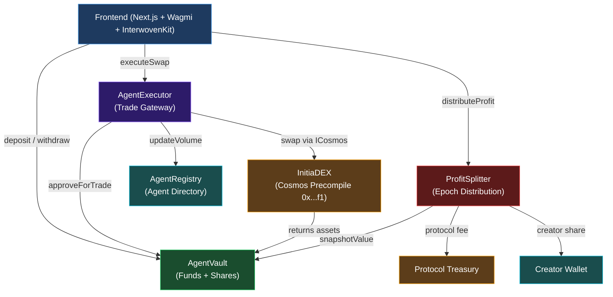
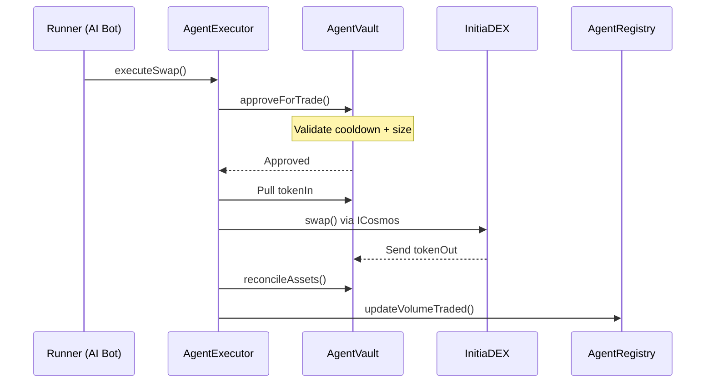
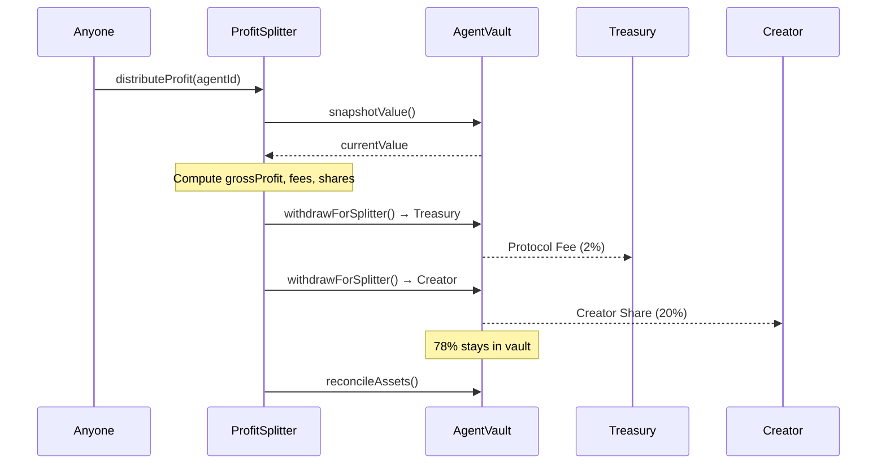
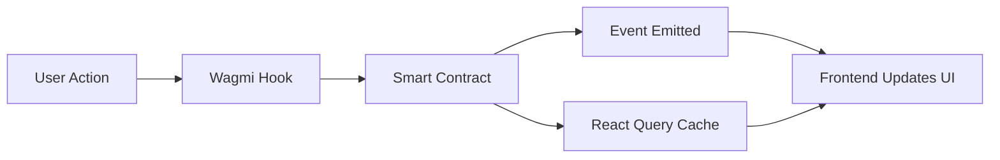

# Architecture

## System Overview

InitiaAgent is composed of four smart contracts on Initia evm-1, a Next.js frontend, a standalone Express.js backend, and off-chain AI runners.



## Contract Interactions

### Trade Execution Flow



### Profit Distribution Flow



## Frontend Architecture

### Tech Stack

| Layer | Technology |
|---|---|
| Framework | Next.js 16.2 (App Router) |
| UI | React 19, Tailwind CSS v4, shadcn/ui |
| Animations | Framer Motion |
| Charts | Recharts |
| Web3 | Wagmi 2.17, Viem 2.47 |
| Wallet | InterwovenKit (`@initia/interwovenkit-react`) |
| State | React Query, React hooks |
| **Backend** | Express.js (TypeScript, port 4000) |
| **AI** | Anthropic Claude + Google Gemini (model cascade) |
| **Database** | Neon serverless PostgreSQL |

### Route Structure

| Route | Purpose |
|---|---|
| `/` | Landing page |
| `/app/marketplace` | Browse and subscribe to agents |
| `/app/builder` | Create and deploy new agents |
| `/app/dashboard` | Monitor portfolio, agents, and AI activity |
| `/app/leaderboard` | Agent performance rankings |

### API Routes

All `/api/*` routes are handled by the **Express.js backend** (port 4000). The Next.js frontend proxies them transparently via `next.config.ts` rewrites.

| Endpoint | Method | Purpose |
|---|---|---|
| `/api/agents` | GET | List all registered agents |
| `/api/agents` | POST | Create a new agent |
| `/api/agents/:id` | DELETE | Remove an agent |
| `/api/agent/analyze` | POST | AI market analysis (signal, confidence, reasoning) |
| `/api/agent/chat` | POST | AI chat assistant with portfolio context |
| `/api/agent/execute` | POST | Simulated trade execution |
| `/api/agent/lp-fee` | POST | LP fee calculation |
| `/api/agent/consensus` | POST | Multi-model voting signal |
| `/api/agent/optimize` | POST | Strategy optimizer |
| `/api/agent/risk` | POST | Portfolio risk score (0–100) |
| `/api/agent/epoch` | POST | Epoch performance report |

### Data Flow



Agent metadata is persisted in **Neon serverless PostgreSQL**. The backend degrades gracefully to in-memory state if `DATABASE_URL` is not set. On-chain state (balances, shares, vault values) is read directly from contracts via Wagmi/Viem.

## AI Integration

The AI layer uses a multi-model cascade. Every request tries each model in order until one succeeds:

```
claude-sonnet-4-6 → gemini-2.5-flash → claude-haiku-4-5 → gemini-2.5-pro → Claude CLI
```

Core AI functions:

1. **Market Analysis** — analyzes strategy + market conditions → returns BUY/SELL/HOLD signal with confidence and reasoning
2. **Chat Assistant** — conversational AI with portfolio context and live price data
3. **Consensus Signal** — multiple models vote independently; majority wins
4. **Strategy Optimizer** — suggests take-profit, stop-loss, and position sizing improvements
5. **Risk Assessment** — portfolio risk score 0–100 across concentration, smart contract, and liquidity risk
6. **Epoch Report** — performance analysis and recommendations for each epoch

Price data is sourced from CoinGecko (primary) and Pyth Network (fallback), covering ETH, BTC, SOL, ATOM, TIA, USDC, and INIT.
