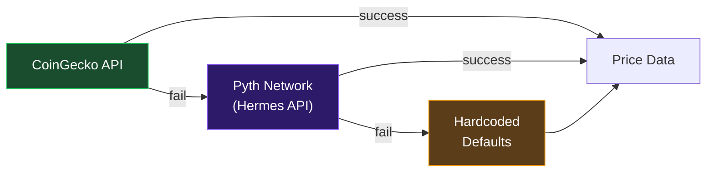

# Integrations

InitiaAgent integrates with several external systems across the Initia ecosystem and beyond.

## InterwovenKit

**Package:** `@initia/interwovenkit-react`

InterwovenKit provides wallet connectivity and session management for the Initia ecosystem.

### Usage in InitiaAgent

- **Wallet connection** — connect to Initia-compatible wallets
- **Session UX / Ghost Wallet** — auto-signing for pre-approved message types
- **Chain management** — switching between Initia networks
- **Testnet configuration** — connects to `TESTNET` environment

### Auto-Signing Configuration

```typescript
// Approved message types for auto-signing
"/minievm.evm.v1.MsgCall"      // EVM contract calls
"/cosmos.bank.v1beta1.MsgSend" // Token transfers
```

## ICosmos Precompile

**Address:** `0x00000000000000000000000000000000000000f1`

The Initia Cosmos precompile enables EVM contracts to execute Cosmos SDK messages.

### Functions Used

| Function | Purpose |
|---|---|
| `execute_cosmos(msg)` | Execute a JSON-encoded Cosmos SDK message |
| `to_denom(erc20Address)` | Convert ERC-20 address to Cosmos IBC denom |
| `to_erc20(denom)` | Convert Cosmos denom to ERC-20 address |

### Swap Message Format

The `InitiaDEXAdapter` constructs a JSON-encoded `MsgSwap` for the Initia DEX module:

```json
{
  "@type": "/initia.dex.v1.MsgSwap",
  "sender": "<adapter_address>",
  "offer_coin": {
    "denom": "<cosmos_denom>",
    "amount": "<amount>"
  },
  "ask_denom": "<target_cosmos_denom>",
  "receiver": "<vault_address>"
}
```

## Wagmi + Viem

**Packages:** `wagmi@2.17.2`, `viem@2.47.6`

### Chain Configuration

```typescript
const evm1 = defineChain({
  id: 2124225178762456,
  name: "Initia evm-1",
  nativeCurrency: { name: "INIT", symbol: "INIT", decimals: 18 },
  rpcUrls: {
    default: {
      http: ["https://jsonrpc-evm-1.anvil.asia-southeast.initia.xyz"]
    }
  }
})
```

### Contract Interactions

Wagmi hooks are used for all contract reads and writes:
- `useReadContract` — read vault balances, share counts, agent info
- `useWriteContract` — deposit, withdraw, approve, executeSwap
- `useSwitchChain` — ensure user is on evm-1 before transactions

## Google Gemini AI

**Package:** `@google/genai`

### Models

| Priority | Model | Usage |
|---|---|---|
| Primary | `gemini-3-flash-preview` | Market analysis and chat |
| Fallback | `gemini-2.0-flash` | Used if primary model fails |
| Emergency | Simulation mode | Deterministic responses if all models fail |

### Endpoints

| Feature | System Role |
|---|---|
| Market Analysis | Trading agent specializing in DeFi strategy analysis |
| Chat Assistant | Wealth manager and strategy optimizer with portfolio context |

## Price Feeds

### CoinGecko (Primary)

Free API for token prices and 24-hour changes. Covers: ETH, BTC, SOL, ATOM, TIA, USDC, INIT.

### Pyth Network (Fallback)

Hermes API endpoint for high-fidelity price data with confidence intervals and EMA values. Used when CoinGecko is unavailable.

### Fallback Chain



## Initia.js

**Package:** `@initia/initia.js`

Initia SDK for direct interaction with Initia L1 and L2 chains. Available for Cosmos-level operations beyond what EVM provides.
