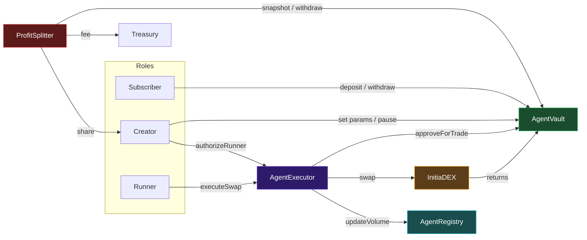

# Smart Contracts Overview

## Contract System

InitiaAgent consists of four core contracts deployed on Initia evm-1 (Solidity 0.8.24):

| Contract | Responsibility |
|---|---|
| [AgentRegistry](./agent-registry.md) | Central directory of all agents. Tracks subscribers, volume, and status. |
| [AgentVault](./agent-vault.md) | Holds subscriber funds. Issues shares. Gates trade approvals. |
| [AgentExecutor](./agent-executor.md) | Validates runner authorization. Dispatches swaps to DEX. |
| [ProfitSplitter](./profit-splitter.md) | Epoch-based profit distribution to protocol, creator, and subscribers. |

## Supporting Contracts

| Contract | Purpose |
|---|---|
| `InitiaDEXAdapter` | Production swap adapter via ICosmos precompile |
| `MockInitiaDEX` | Test DEX with configurable exchange rates |
| `MockERC20` | Test tokens (INIT, USDC) with public mint |
| `ICosmos` | Interface for Initia Cosmos precompile at `0x...f1` |

## Access Control Matrix

| Action | Creator | Subscriber | Runner | Executor | Splitter | Owner |
|---|:---:|:---:|:---:|:---:|:---:|:---:|
| `deposit` | | Yes | | | | |
| `withdraw` | | Yes | | | | |
| `approveForTrade` | | | | Yes | | |
| `executeSwap` | | | Yes | | | |
| `withdrawForSplitter` | | | | | Yes | |
| `distributeProfit` | Anyone | Anyone | Anyone | Anyone | Anyone | Anyone |
| `pauseVault` | Yes | | | | | |
| `setExecutor` (registry) | | | | | | Yes |
| `updateDEX` | | | | | | Yes |

## Security Invariants

1. **Creator cannot steal funds** — no path to call `withdraw` or access subscriber shares
2. **Splitter is set once** — `setSplitter` reverts on second call (`SplitterAlreadySet`)
3. **Withdrawal always available** — no `whenNotPaused` guard on `withdraw`
4. **Trade size is capped** — `maxTradeBps` hard cap at 30% (3,000 bps)
5. **Cooldown enforced** — minimum 60 seconds between trades
6. **Volume tracking is reliable** — executor is linked to registry via `setExecutor`

## Compiler Settings

| Setting | Value |
|---|---|
| Solidity | 0.8.24 |
| Optimizer | Enabled, 200 runs |
| Via IR | `true` |

## Error and Event Organization

All custom errors are defined in `src/errors/Errors.sol` and all events in `src/events/Events.sol`, organized by contract. Contracts inherit from these shared definitions.
