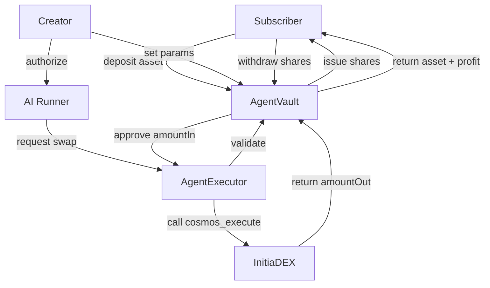

# System Architecture

InitiaAgent leverages the Initia `evm-1` rollup to provide a seamless, non-custodial trading experience.

## 1. Flow of Funds (Non-Custodial)

The following diagram illustrates how subscriber funds are managed without the creator ever gaining custody.

## 2. Trading Execution Loop

Each trade follows a strict validation pipeline to ensure security and compliance with creator-defined bounds.

1.  **Authorization Check**: Only runners explicitly authorized by the creator via `AgentExecutor.authorizeRunner` can trigger trades.
2.  **Cooldown Check**: `AgentVault` enforces a minimum interval (`intervalSeconds`) between trades to prevent sandwich attacks and excessive churn.
3.  **Trade Size Check**: `AgentVault` limits each trade to a maximum percentage of total assets (`maxTradeBps`).
4.  **Slippage Guard**: The `AgentExecutor` checks the output amount from the `InitiaDEX` against the `minAmountOut` provided by the runner.
5.  **Reconciliation**: The vault balance is updated using `reconcileAssets` after each trade.

## 3. Epoch-Based Profit Distribution

Profit distribution is automated through the `ProfitSplitter` contract.

- **Check Epoch**: Anyone can trigger distribution if `epochDuration` has passed.
- **Snapshot**: The splitter takes a snapshot of the vault's `totalAssets`.
- **Compute Gross Profit**: `currentValue - lastSnapshotValue`.
- **Allocation**:
    - **Protocol Fee**: 2% of profit.
    - **Creator Share**: 20% of net profit.
    - **Subscriber Share**: Remaining profit stays in the vault, increasing the value of each share.

---

Detailed specifications for individual contracts can be found in [SMART_CONTRACTS.md](./SMART_CONTRACTS.md).
