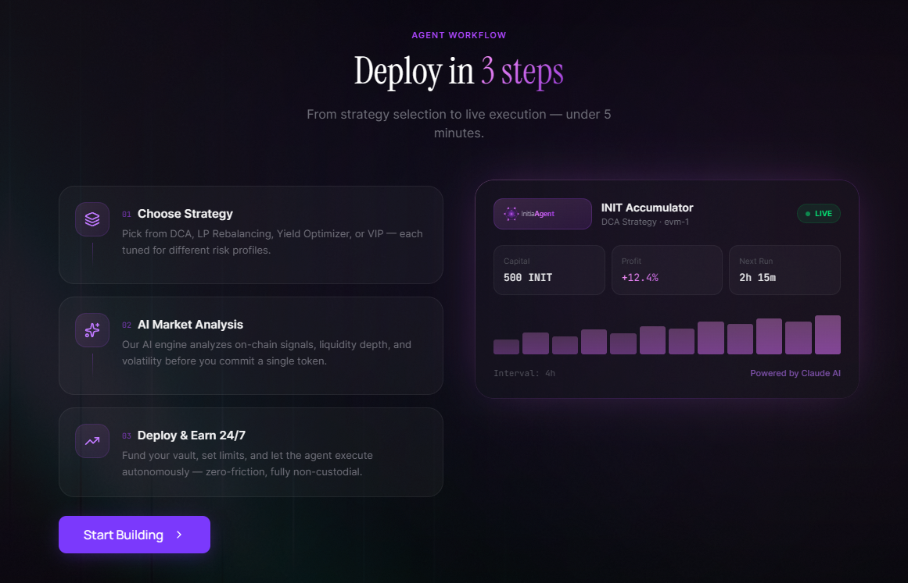
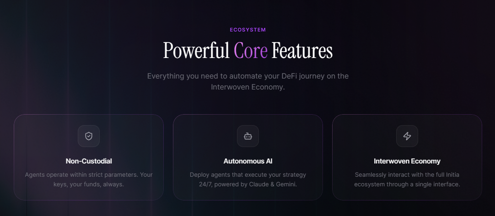

# InitiaAgent

> [!IMPORTANT]
> **NON-COMMERCIAL HACKATHON PROJECT** — This repository is submitted exclusively for the **INITIATE Season 1 Hackathon** (Initia x DoraHacks). It is an educational and competitive submission only. No real funds are involved. Not intended for commercial use.

> **Non-custodial AI trading agent marketplace on Initia EVM** — creators deploy strategies, subscribers earn yield, and smart contracts guarantee that no one can touch your principal.

   

---

## What is InitiaAgent?

InitiaAgent is a four-contract system where **agent creators** publish automated trading strategies and **subscribers** deposit funds into non-custodial vaults. An off-chain **AI runner** executes trades within strict on-chain bounds, and profits are distributed automatically each epoch.

The core security guarantee: **creators can never access subscriber principal** — enforced entirely at the smart contract level.

### Key Properties

| Property | Detail |
|---|---|
| **Non-Custodial** | Creator controls parameters but cannot withdraw subscriber funds |
| **Instant Exit** | Subscribers can withdraw anytime, even when the vault is paused |
| **Permissionless Profit** | Anyone can trigger `distributeProfit()` after each epoch |
| **Bounded Trading** | Every trade is capped at 30% of vault and rate-limited by cooldown |

---

## How It Works

```mermaid
sequenceDiagram
    participant S as Subscriber
    participant V as AgentVault
    participant E as AgentExecutor
    participant D as InitiaDEX (Cosmos)

    S->>V: deposit()
    Note over V: Issues Shares

    rect rgb(40, 40, 60)
    Note over V,D: Trading Session (loop)
    E->>V: approveForTrade()
    Note over V: Check Cooldown/Cap
    E->>D: executeSwap() via Precompile
    D-->>V: Returns Assets
    end

    S->>V: withdraw()
    Note over V: Redeems Shares
    V-->>S: Returns Assets
```

---

## Core Features

## Explore the Docs

<table data-view="cards">
<thead><tr><th></th><th></th></tr></thead>
<tbody>
<tr><td><strong>Overview</strong></td><td>What InitiaAgent is, the problem it solves, and why it's built on Initia</td></tr>
<tr><td><strong>Features</strong></td><td>Marketplace, Builder, Vault, Dashboard, and Profit Sharing walkthrough</td></tr>
<tr><td><strong>Technical</strong></td><td>System architecture, smart contract specs, runner design, and integrations</td></tr>
<tr><td><strong>Resources</strong></td><td>Deployed contract addresses, roadmap, and external links</td></tr>
</tbody>
</table>

| Section | Start Here |
|---|---|
| **Overview** | [Problem Statement](./overview/problem.md) → [Solution](./overview/solution.md) → [Why Initia?](./overview/why-initia.md) → [How It Works](./overview/how-it-works.md) |
| **Features** | [Agent Marketplace](./features/agent-marketplace.md) → [Agent Builder](./features/agent-builder.md) → [Agent Vault](./features/agent-vault.md) → [Live Dashboard](./features/live-dashboard.md) → [Profit Sharing](./features/profit-sharing.md) |
| **Technical** | [Architecture](./technical/architecture.md) → [Smart Contracts](./technical/smart-contracts/overview.md) → [Agent Runner](./technical/agent-runner.md) → [Integrations](./technical/integrations.md) |
| **Resources** | [Contract Addresses](./resources/contract-addresses.md) · [Roadmap](./resources/roadmap.md) · [Links](./resources/links.md) |

---

## Who Is This For?

| Role | What You Can Do |
|---|---|
| **Subscriber** | Browse agents, deposit funds, earn passive returns, withdraw anytime |
| **Creator** | Build and deploy trading strategies, earn 20% of generated profit |
| **Runner** | Operate off-chain AI bots that execute trades on behalf of agents |
| **Developer** | Read the contract specs, understand the architecture, build integrations |

---

## Quick Links

- **Live App:** [initiaagent.vercel.app](https://initiaagent.vercel.app/)
- **Backend API:** [initiaagent-backend-railway.up.railway.app](https://initiaagent-backend-railway.up.railway.app)
- **Demo Video:** [Watch on YouTube](https://www.youtube.com/watch?v=g0jYPD1gF14)
- **Pitch Deck:** [View Presentation](http://tiny.cc/pitch-deck-initiate-agent)
- **Block Explorer:** [Initia Scan (evm-1)](https://scan.testnet.initia.xyz/evm-1)
- **Hackathon:** [INITIATE Season 1](https://dorahacks.io/hackathon/initia) by Initia x DoraHacks
- **Chain ID:** `2124225178762456`
- **RPC:** `https://jsonrpc-evm-1.anvil.asia-southeast.initia.xyz`

---

Built for **INITIATE Season 1** by Initia x DoraHacks.
