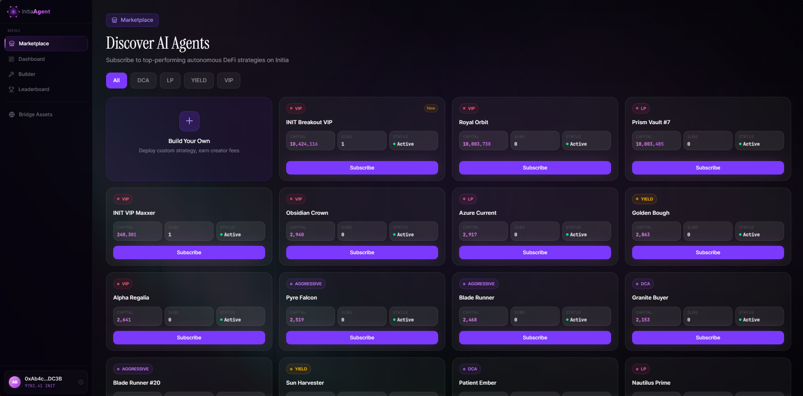
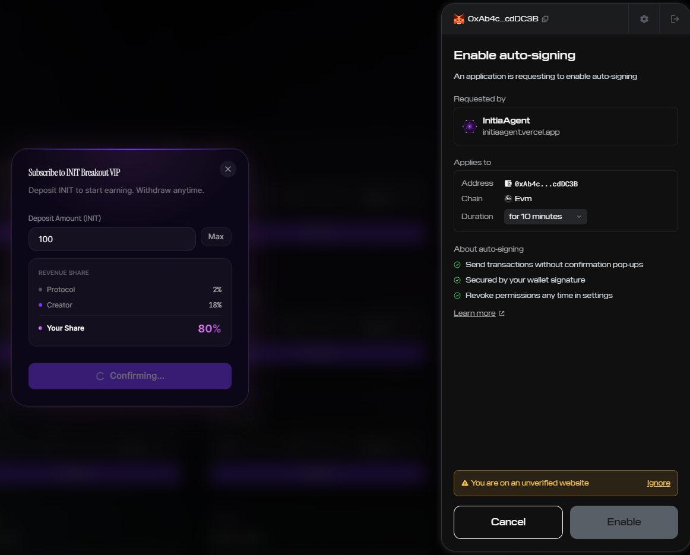
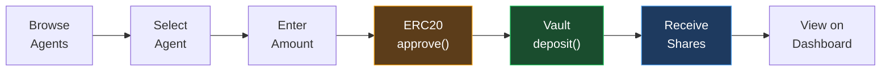

# Agent Marketplace

The marketplace is the main entry point for subscribers looking to invest in automated trading strategies.

## What It Does

The marketplace displays all registered agents, allowing subscribers to:

- **Browse agents** — view strategy type, estimated TVL, subscriber count, and status
- **Compare strategies** — DCA, LP Auto-Rebalancing, Yield Optimizer, VIP Maximizer
- **Subscribe with one click** — deposit tokens directly into an agent's vault

## Subscribing to an Agent

### Prerequisites
- Wallet connected via InterwovenKit
- INIT tokens on evm-1 testnet (bridge from L1 or use faucet)

### Flow

1. **Select an agent** from the marketplace grid
2. **Open the subscribe dialog** — view agent details and revenue split
3. **Enter deposit amount** — see your current INIT balance
4. **Approve & Deposit** — two transactions:
   - `ERC20.approve(vaultAddress, amount)` — authorize the vault to pull tokens
   - `AgentVault.deposit(amount)` — deposit and receive proportional shares
5. **Confirmation** — agent appears on your dashboard

### Revenue Split Display

Each agent card shows the profit distribution:

| Recipient | Share |
|---|---|
| Protocol | 2% |
| Creator | 18% |
| Subscriber | 80% |

## Featured Agents

The marketplace includes pre-configured demo agents to showcase different strategy types. These are always visible for demonstration purposes, alongside any user-created agents.

## Chain Switching

If the user's wallet is connected to a different network, the marketplace automatically prompts switching to Initia evm-1 (Chain ID: `2124225178762456`) before any transaction.
