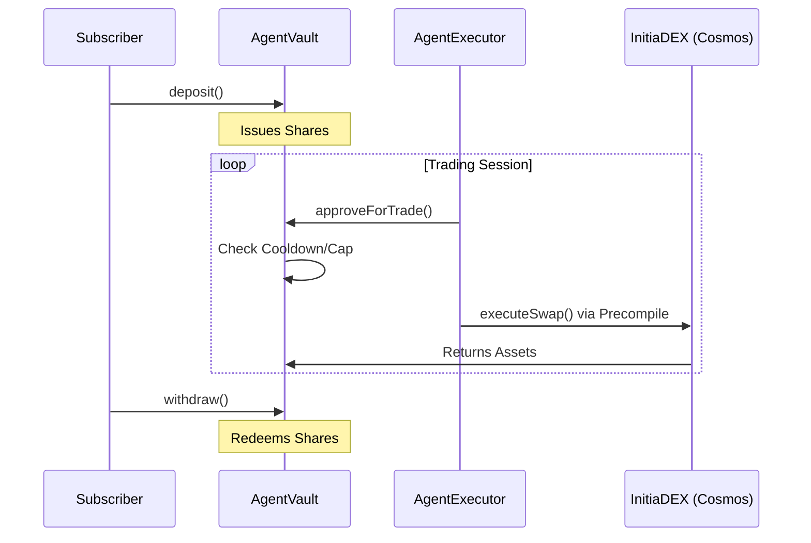

# InitiaAgent 🤖

> [!IMPORTANT]
> **NON-COMMERCIAL HACKATHON PROJECT** — This repository is submitted exclusively for the **INITIATE Season 1 Hackathon** (Initia x DoraHacks). It is an educational and competitive submission only. No real funds are involved. Not intended for commercial use.

[](https://dorahacks.io/hackathon/initiate)
[](https://scan.testnet.initia.xyz/evm-1)

**InitiaAgent** is a non-custodial AI trading agent marketplace built on Initia EVM (evm-1 MiniEVM L2 rollup). Agent creators deploy automated trading strategies that execute on behalf of subscribers, with profits distributed automatically each epoch. The core security guarantee — creators can never access subscriber principal — is enforced entirely at the smart contract level.

---

## 🎥 Demo Video
> [!IMPORTANT]
> **Video Recording in Progress** — Demonstrating non-custodial trading and Initia-native Session UX. Will be uploaded before the April 15 deadline.

---

## 🚀 Hackathon Compliance

| Requirement | Evidence / Implementation |
|---|---|
| **Appchain / Rollup** | Deployed on `evm-1` (Chain ID: `2124225178762456`) |
| **InterwovenKit** | Integrated via `@initia/interwovenkit-react` |
| **Native Feature** | **Session UX / Auto-signing** for seamless trade execution |
| **Submission File** | Found in [`.initia/submission.json`](./.initia/submission.json) |

---

## 🔗 Deployed Contracts (evm-1 Testnet)

| Contract | Address | Explorer |
|---|---|---|
| AgentRegistry | `0xBF1Bf9E5113fdF25b2104c9494F518C46caC3C5D` | [View](https://scan.testnet.initia.xyz/evm-1/accounts/0xBF1Bf9E5113fdF25b2104c9494F518C46caC3C5D) |
| AgentExecutor | `0x0777CA550E0dFB9c64deb88A871a3ad867c2e014` | [View](https://scan.testnet.initia.xyz/evm-1/accounts/0x0777CA550E0dFB9c64deb88A871a3ad867c2e014) |
| ProfitSplitter | `0x9D925037CA3e28d3943cea6aA7cBF36b4f681D9F` | [View](https://scan.testnet.initia.xyz/evm-1/accounts/0x9D925037CA3e28d3943cea6aA7cBF36b4f681D9F) |
| AgentVault | `0xe3DCC86978d57d0753d60bca3687dbbbB8f104D6` | [View](https://scan.testnet.initia.xyz/evm-1/accounts/0xe3DCC86978d57d0753d60bca3687dbbbB8f104D6) |

---

## 📊 Architecture



Detailed technical breakdown available in [ARCHITECTURE.md](./docs/ARCHITECTURE.md).

---

## 🛠️ Tech Stack

- **Core**: Next.js 16.2 (App Router), React 19
- **Connectivity**: `@initia/interwovenkit-react`
- **Smart Contracts**: Solidity 0.8.24 (EVM-1 MiniEVM)
- **Native Integration**: `ICosmos` precompile (`0x...f1`) for atomic DEX swaps.

---

## ⚙️ Local Development Setup

### 1. Clone & Install

```bash
git clone <repo-url>
cd FrontEnd
npm install
```

### 2. Buat `.env.local`

```bash
cp .env.example .env.local
```

Isi `.env.local` — **pastikan tidak ada spasi di depan nama variable**:

```env
NEXT_PUBLIC_APP_URL=http://localhost:3000
# Optional (default sudah lewat rewrite /api): isi origin backend tanpa "/api"
# NEXT_PUBLIC_API_URL=http://localhost:4000

# Gemini AI — https://aistudio.google.com/app/apikey
GEMINI_API_KEY=your_gemini_api_key_here

# Wallet untuk auto-sign (12/24 kata mnemonic)
NEXT_PUBLIC_WALLET_MNEMONIC=word1 word2 word3 ... word12
```

> ⚠️ Jangan commit `.env.local`. File ini sudah ada di `.gitignore`.

### 3. Generate wallet baru

Jalankan di terminal project:

```bash
node -e "const { ethers } = require('ethers'); const w = ethers.Wallet.createRandom(); console.log('Mnemonic:', w.mnemonic.phrase); console.log('Address:', w.address);"
```

Copy 12 kata mnemonic → paste ke `NEXT_PUBLIC_WALLET_MNEMONIC`.

### 4. Fund wallet di faucet

1. Buka https://app.testnet.initia.xyz/faucet
2. Paste address wallet (0x...) dari langkah 3
3. Pilih chain **evm-1** → Submit

> Tanpa ini semua contract interaction akan **Failed**.

### 5. Jalankan

```bash
npm run dev
```

Buka http://localhost:3000

---

## 🔑 Session UX (Auto-Sign)

Setelah setup selesai:

1. Wallet otomatis connect dari mnemonic di `.env.local`
2. Klik tombol **Session UX** (⚡) di navbar
3. Approve sekali → selesai, AI trading tanpa popup wallet

---

## 🐛 Troubleshooting

| Error | Solusi |
|---|---|
| `Contract interaction Failed` | Wallet belum di-fund → pergi ke faucet evm-1 |
| Session UX button disabled/abu-abu | Jalankan: `npm install @initia/interwovenkit-react@2.5.1` |
| `Unable to verify account status` | Initia testnet node sedang down, tunggu beberapa menit |
| Wallet tidak auto-connect | Cek `.env.local` — hapus spasi di depan `NEXT_PUBLIC_WALLET_MNEMONIC` |
| AI analysis tidak jalan | `GEMINI_API_KEY` belum diisi atau expired |

---

## 🛡️ Security Invariants

- **Non-Custodial**: Creators control parameters (cooldown, max trade bps) but CANNOT withdraw subscriber funds.
- **Permissionless Profit**: `distributeProfit` is callable by anyone after each epoch.
- **Instant Exit**: `withdraw` is always available to subscribers, even if the vault is paused.

---

## 📖 Documentation Index

- [Smart Contract Specification](./docs/SMART_CONTRACTS.md)
- [System Architecture & Flows](./docs/ARCHITECTURE.md)
- [Local Development Guide](./docs/DEVELOPMENT.md)

---

Built for **INITIATE Season 1** by **3S DW**.
